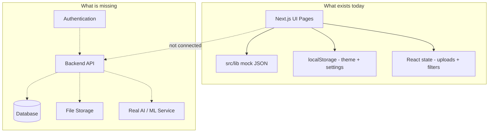

# ATE Intelligence Platform

Enterprise-grade Automated Test Equipment (ATE) dashboard built with Next.js, TypeScript, Tailwind CSS, shadcn/ui, Recharts, Lucide Icons, Framer Motion, and React Query.

## Quick Start

```bash
cd ate-dashboard
npm install
npm run dev
```

Open [http://localhost:3000/dashboard](http://localhost:3000/dashboard) or [http://localhost:3000/scan-chain](http://localhost:3000/scan-chain)

## Contents

- [Tech Stack](#tech-stack)
- [Pages](#pages)
- [UI/UX Functionality](#uiux-functionality) — layouts, interactions, uploads, feature matrix
- [Project Structure](#project-structure)
- [Prompt → Code Mapping](#prompt--code-mapping)
- [Application Completeness Audit](#application-completeness-audit) — frontend vs backend, gaps, roadmap
- [Current State & Known Gaps](#current-state--known-gaps)

## Tech Stack

| Technology | Purpose |
|---|---|
| Next.js (App Router) | Framework & routing |
| TypeScript | Type safety |
| Tailwind CSS v4 | Styling |
| shadcn/ui | UI components |
| Recharts | Charts & sparklines |
| Lucide React | Icons |
| Framer Motion | Animations |
| React Query | Data fetching layer |

## Pages

| Route | Description |
|---|---|
| `/dashboard` | Executive dashboard with KPIs, wafer heatmap, pattern table, cost chart, optimization engine |
| `/scan-chain` | Scan Chain Analysis dashboard with 4 tabs (Overview, Pattern Analysis, Failure Analysis, Scan Diagnosis) |
| `/mbist` | MBIST Analysis dashboard with 5 tabs (Overview, Memory Health, Failure Analysis, Diagnosis, AI Recommendation) |
| `/lbist` | LBIST Analysis dashboard with 5 tabs (Overview, Coverage Analysis, Failure Analysis, Diagnosis, AI Recommendation) |
| `/wafer-analysis` | Wafer Analysis dashboard with 10 tabs (Overview + 9 defect classes) — redirects to `/dashboard/wafer-analysis` |
| `/dashboard/wafer-analysis` | Wafer Analysis — AI defect classification, canvas overlay/density maps, upload list |
| `/recommendation-analysis` | AI Recommendation Center with 3 agent tabs (Pattern, Scan Debug, Test Optimization) |
| `/cost-intelligence` | Cost Intelligence dashboard with 6 tabs (Overview, Scan Chain, MBIST, LBIST, Wafer, AI Cost Optimization) |
| `/alerts` | Enterprise Alerts dashboard with 7 tabs consolidating all module alerts |
| Upload Data / Upload Log File | Top navbar modals — frontend UI only (react-dropzone, simulated progress) |
| `/dashboard/recommendation-analysis` | Redirects to `/recommendation-analysis` |
| `/settings` | Theme Settings & Account Presets |
| `/` | Redirects to `/dashboard` |

> **Scope:** This platform is a **frontend UI/UX prototype**. All dashboards use mock JSON data. Upload, AI optimization, and filter actions are simulated in the browser — there is no backend API or database.

## UI/UX Functionality

This section documents every user-facing interaction in the platform: what works in the UI, what is simulated, and what is cosmetic only.

### Development Scope

| Layer | Status |
|---|---|
| UI / UX (layouts, modals, tables, charts, animations) | ✅ Implemented |
| Mock data (`src/lib/*.ts`) | ✅ Implemented |
| Client-side state (upload history, theme, settings) | ✅ Implemented |
| Backend API / database | ❌ Not implemented |
| Real file upload / parsing | ❌ Simulated only |
| Real AI / ML models | ❌ Simulated only |

---

### Global Layout

Every dashboard page uses the same shell:

| Region | Component | UI behavior |
|---|---|---|
| Left sidebar (280px) | `Sidebar.tsx` | Fixed nav, active route highlight (purple gradient), Settings link, Quick Filters panel |
| Top header (72px) | `TopNavbar.tsx` | Sticky, glass blur, page title + subtitle, action buttons |
| Main content | `DashboardLayout` | Scrollable area with 24px padding and tab content |

**Active route styling:** Purple gradient background, ring glow, and bold label on the current module (e.g. Scan Chain, Cost Intelligence, Alerts).

---

### Top Navigation Bar

Button order (left → right after search):

```
Calendar → Notifications → Upload Data → Upload Log File → Profile → Export Report → Primary Action
```

| Control | UI behavior | Backend |
|---|---|---|
| **Search** | Input renders with page-specific placeholder | ⚠️ Cosmetic — no search logic |
| **Calendar** | Icon button | ⚠️ No-op |
| **Notifications (Bell)** | Icon button | ⚠️ No-op (no dropdown) |
| **Upload Data** | Opens modal — drag-drop, metadata, progress, history | ✅ UI — simulated upload |
| **Upload Log File** | Opens modal — validation, pipeline, AI summary, history | ✅ UI — simulated upload |
| **Profile** | Shows avatar + name (desktop) | Static display |
| **Export Report** | Outline button | ⚠️ No-op |
| **Primary action** | Purple glow button — label changes per page (e.g. AI Optimize, Generate Cost Optimization, Mark All as Read) | ⚠️ No-op (button only) |

On **mobile**, Upload Data collapses to a single upload icon; other buttons hide at smaller breakpoints.

---

### Sidebar & Quick Filters

**Navigation routes:**

| Menu item | Route |
|---|---|
| Dashboard | `/dashboard` |
| Scan Chain Analysis | `/scan-chain` |
| MBIST Analysis | `/mbist` |
| LBIST Analysis | `/lbist` |
| Wafer Analysis | `/dashboard/wafer-analysis` |
| Cost Intelligence | `/cost-intelligence` |
| Recommendation Analysis | `/recommendation-analysis` |
| Alerts | `/alerts` |
| Settings | `/settings` |

**Quick Filters panel** (bottom of sidebar):

- Dropdowns: **Date Range**, **Fab**, **Tester**, **Product**
- **Reset Filters** button restores defaults
- State is stored in `DashboardLayout` via React `useState`
- ⚠️ **UI only** — changing filters does not refresh charts or tables

Quick Filters are hidden on the Settings page (`hideQuickFilters`).

---

### Shared UI Patterns

Used consistently across all analysis dashboards:

| Pattern | Description |
|---|---|
| **KPI cards** | 6-card grid, icon, value, % change badge, Recharts sparkline, hover lift, Framer Motion entrance |
| **Secondary tabs** | Horizontal nav with purple animated underline (`layoutId` spring transition) |
| **Tab content** | Keep-alive tab switching (`TabPanelHost` — mount once, hide inactive) |
| **Chart cards** | Glass card wrapper with title, subtitle, Recharts chart inside |
| **Data tables** | Search, column sort, pagination, sticky header, row hover |
| **Priority / severity badges** | Critical (red), High (orange), Medium (yellow), Low (green) |
| **Module badges** | Color-coded by source (Scan Chain, MBIST, LBIST, Wafer, Cost, AI) |
| **AI summary cards** | Gradient border, glow, primary CTA button (simulated action) |
| **Heatmaps** | Grid cells with color scale; tooltip on hover; SSR-safe seeded values (no hydration mismatch) |
| **Glass cards** | `#111827` background, `#2D3748` border, 20px radius, gradient border on hover |

**Reusable components:**

- `src/components/scan-chain/DataTable.tsx` — generic sortable/searchable table
- `src/components/scan-chain/ChartCard.tsx` — chart container
- `src/components/scan-chain/charts/*` — donut, bar, line, pie charts
- `src/lib/heatmapUtils.ts` — deterministic heatmap data (fixes SSR hydration)

---

### Upload Data (Structured Datasets)

**Entry:** Top navbar → **Upload Data** (purple gradient, `UploadCloud` icon)

**Modal features:**

| Feature | UI behavior |
|---|---|
| Drag & drop zone | `react-dropzone` — click or drop files |
| Supported formats | STDF, STIL, WGL, CSV, XLSX, JSON, ZIP, XML (max 10 GB) |
| File info | Name, size, upload time after selection |
| Dataset category | Dropdown: Auto Detect, Scan Chain, MBIST, LBIST, Wafer, Cost, Recommendation |
| Metadata | Fab, Tester, Product, Lot ID, Wafer ID, optional notes |
| Progress bar | Animated % with speed, elapsed, remaining (simulated) |
| Upload history | Searchable table with module/status filters, delete, retry, download actions |
| Toasts | Upload started, success, AI analysis ready |

**On Upload click:** Simulated progress → record added to client-side history → success toast → modal closes. No server request.

**Shared upload components:**

| Component | Role |
|---|---|
| `UploadDropzone.tsx` | Drag-and-drop zone (react-dropzone) |
| `UploadProgressPanel.tsx` | Speed, elapsed, remaining, % bar |
| `UploadHistoryTable.tsx` | Searchable history with row actions |
| `UploadToastStack.tsx` | Slide-in notifications (auto-dismiss 4s) |

**Files:** `src/components/upload/UploadDataModal.tsx`, `src/contexts/UploadContext.tsx`, `src/lib/uploadData.ts`

---

### Upload Log File (Raw ATE Logs)

**Entry:** Top navbar → **Upload Log File** (dark glass, purple border, `FileText` icon)

**Modal features:**

| Feature | UI behavior |
|---|---|
| Drag & drop zone | Multi-file support via react-dropzone |
| Supported formats | STDF, STIL, WGL, LOG, TXT, CSV, JSON, XML, ZIP, GZ (max 5 GB) |
| Log source | Auto Detect, Scan Chain, MBIST, LBIST, Wafer, Cost, Recommendation |
| Tester | UltraFlex, UltraFLEX Plus, V93000, J750, T2000, Other |
| Metadata | Fab, Tester ID, Product, Lot, Wafer, Device, Operator, Comments |
| File validation | Type, corrupt, unsupported, duplicate, missing metadata checks (client-side) |
| Progress | Speed, elapsed, remaining, percentage |
| Processing pipeline | 5 animated steps: Validate → Parse → Extract → AI Insights → Store |
| AI log summary | Patterns, scan chains, memory/logic blocks, yield, cost, savings |
| Upload history | Full enterprise table with View, Download, Retry, Delete |
| Toasts | Upload started, completed, failed, parsing complete, AI analysis ready |

**Files:** `src/components/upload/UploadLogFileModal.tsx`

---

### Module Dashboards (UI/UX by Page)

#### Executive Dashboard (`/dashboard`)
- 6 KPI cards, wafer canvas heatmap (pan/zoom/fullscreen), pattern table, cost trend chart
- Optimization engine sliders + simulated AI run (1.8s) → results panel

#### Scan Chain Analysis (`/scan-chain`) — 4 tabs
Overview · Pattern Analysis · Failure Analysis · Scan Diagnosis

#### MBIST Analysis (`/mbist`) — 5 tabs
Overview · Memory Health · Failure Analysis · Diagnosis · AI Recommendation

#### LBIST Analysis (`/lbist`) — 5 tabs
Overview · Coverage Analysis · Failure Analysis · Diagnosis · AI Recommendation

#### Wafer Analysis (`/dashboard/wafer-analysis`) — 10 tabs
Overview · Centre · Donut · Edge-Ring · Scratch · Near-Full · Normal · Edge-Loc · Local · Random

- **Overview:** 5 input/die KPIs, 9 clickable defect-class KPIs, positive/negative yield donut, 9-card gallery, upload workflow, bottom summary
- **Defect tabs (×9):** shared layout — header, 8 KPIs, selectable upload list (10 items), canvas overlay analytics + fail density map, info panel, analysis workflow
- **Removed from Overview:** yield trend, yield distribution, defect breakdown, recent wafer yield, top defect wafers table
- **Removed from defect tabs:** class probability chart, AI insights, wafer analysis records table

#### Recommendation Analysis (`/recommendation-analysis`) — 3 AI Agent tabs
Pattern Recommendation Agent · Scan Debug Recommendation Agent · Test Optimization Recommendation Agent — sectioned KPI grids, charts, recommendation tables, AI executive summaries, workflow diagrams, action bars

#### Cost Intelligence (`/cost-intelligence`) — 6 tabs
Overview · Scan Chain Cost · MBIST Cost · LBIST Cost · Wafer Cost · AI Cost Optimization — cost contribution donut, stacked bar, enterprise cost summary

#### Alerts (`/alerts`) — 7 tabs
Overview · Scan Chain · MBIST · LBIST · Wafer · Cost · AI Recommendation Alerts — severity distribution, critical summary, alert workflow, executive summary

#### Settings (`/settings`)
- Theme: appearance, accent color, sidebar style, card style, font size, compact mode, animations
- Account: profile, role, department, language, timezone, notification toggles
- Persisted to `localStorage` via `ThemeContext`

---

### Design System & Theme Tokens

Enterprise dark theme defined in `src/app/globals.css` and overridden at runtime by `ThemeContext`:

| Token | Default | Used for |
|---|---|---|
| `--background` | `#090B12` | Page background |
| `--card` | `#111827` | Glass cards, modals |
| `--border` | `#2D3748` | Card borders, inputs |
| `--accent` / `--primary` | `#7C3AED` | Buttons, active nav, charts |
| `--sidebar` | `#0A1020` | Sidebar background |
| Card radius | `20px` | Glass cards (configurable in Settings) |
| Sidebar width | `280px` | Layout grid (compact / standard / expanded) |

**Settings-driven CSS variables:** accent color (purple, blue, emerald, orange, red), font size, border radius, sidebar width, card style (glass / solid / bordered), compact mode, animation toggle. Changes apply instantly via `document.documentElement` and persist under `ate-theme-config` in `localStorage`.

**Typography:** Inter (headings + body). **Icons:** Lucide React throughout.

---

### Animations & Responsive Design

| Animation | Where used |
|---|---|
| KPI card entrance | Staggered fade + slide up (Framer Motion) |
| Tab underline | Spring-animated purple indicator |
| Tab content | Fade between tabs |
| Hover lift | Cards on mouse over |
| Upload pipeline | Step-by-step progress animation |
| Toast stack | Slide in from right, auto-dismiss after 4s |
| Optimization spinner | Rotating icon during simulated AI run |

| Breakpoint | Layout |
|---|---|
| Desktop (≥1536px) | 6-column KPI grid, full sidebar + navbar buttons |
| Tablet (≤1024px) | Sidebar hidden, 2-column KPI grid |
| Mobile (≤640px) | Single column, compact navbar (upload icon only) |

---

### UI/UX Feature Matrix

| Feature | Interactive in UI | Affects data | Notes |
|---|---|---|---|
| Sidebar navigation | ✅ | ✅ (route change) | Full page navigation |
| Secondary tabs | ✅ | ✅ (tab content) | Per-dashboard tab switching |
| Table search/sort/pagination | ✅ | ✅ (table rows) | Client-side only |
| KPI cards / charts | ✅ | ❌ | Static mock data |
| Sidebar Quick Filters | ✅ | ✅ (Overview KPIs + filtered rows) | Filter engine via `useFilterStore` |
| Top search bar | ✅ | ❌ | Cosmetic input |
| Upload Data modal | ✅ | ✅ (upload history) | Simulated upload |
| Upload Log File modal | ✅ | ✅ (upload history) | Simulated pipeline |
| Export Report | ✅ | ❌ | Button only |
| Primary action (AI Optimize, etc.) | ✅ | ❌ | Button only |
| AI Optimization sliders + run | ✅ | ✅ (results panel) | 1.8s simulated delay |
| Settings save | ✅ | ✅ (localStorage) | Theme + account prefs |
| Notifications bell | ✅ | ❌ | Icon only |
| Calendar button | ✅ | ❌ | Icon only |

---

## Project Structure

```
src/
├── app/
│   ├── dashboard/page.tsx      # Main dashboard (integration)
│   ├── scan-chain/page.tsx     # Scan Chain Analysis dashboard
│   ├── mbist/page.tsx          # MBIST Analysis dashboard
│   ├── lbist/page.tsx          # LBIST Analysis dashboard
│   ├── recommendation-analysis/page.tsx  # Recommendation Analysis dashboard
│   ├── cost-intelligence/page.tsx        # Cost Intelligence dashboard
│   ├── alerts/page.tsx                   # Enterprise Alerts dashboard
│   ├── dashboard/wafer-analysis/page.tsx   # Wafer Analysis dashboard (10 tabs)
│   ├── wafer-analysis/page.tsx             # Redirect to /dashboard/wafer-analysis
│   ├── dashboard/recommendation-analysis/page.tsx  # Legacy redirect
│   ├── settings/page.tsx       # Theme + Account settings
│   ├── layout.tsx              # Root layout (Inter font, providers)
│   ├── page.tsx                # Redirect
│   └── globals.css             # Enterprise theme tokens + glass styles
├── components/
│   ├── layout/                 # Sidebar, TopNavbar, DashboardLayout
│   ├── cards/                  # Executive KPI cards
│   ├── charts/                 # Wafer heatmap, cost trend chart
│   ├── tables/                 # Pattern analysis table
│   ├── scan-chain/             # Scan Chain Analysis components
│   ├── mbist/                  # MBIST Analysis components
│   ├── lbist/                  # LBIST Analysis components
│   ├── recommendation/         # Recommendation Analysis components
│   ├── cost-intelligence/      # Cost Intelligence components
│   ├── alerts/                 # Alerts dashboard components
│   ├── wafer/                  # Wafer Analysis components
│   ├── platform/               # TabPanelHost, EmptyState, GlobalSearch
│   ├── upload/                 # Upload modals, dropzone, progress, history, toasts
│   ├── optimization/           # Optimization engine controls
│   ├── results/                # Optimization results panel
│   ├── providers/              # React Query provider
│   └── ui/                     # shadcn/ui + dialog, progress
├── contexts/
│   ├── ThemeContext.tsx        # Theme persistence (localStorage)
│   └── UploadContext.tsx       # Upload history + toast state (client-only)
├── lib/
│   ├── dummyData.ts            # Executive dashboard mock data
│   ├── scanChainData.ts        # Scan Chain Analysis mock data
│   ├── mbistData.ts            # MBIST Analysis mock data
│   ├── lbistData.ts            # LBIST Analysis mock data
│   ├── recommendationData.ts   # Recommendation Analysis mock data
│   ├── costIntelligenceData.ts # Cost Intelligence mock data
│   ├── alertsData.ts           # Alerts mock data
│   ├── waferData.ts            # Wafer Analysis mock data + image URIs
│   ├── uploadData.ts           # Upload history seed data + helpers
│   └── heatmapUtils.ts         # SSR-safe deterministic heatmap values
├── types/
│   ├── dashboard.ts            # Dashboard data types
│   ├── scanChain.ts            # Scan Chain Analysis types
│   ├── mbist.ts                # MBIST Analysis types
│   ├── lbist.ts                # LBIST Analysis types
│   ├── recommendation.ts       # Recommendation Analysis types
│   ├── costIntelligence.ts     # Cost Intelligence types
│   ├── alerts.ts               # Alerts types
│   ├── wafer.ts                # Wafer Analysis types
│   ├── upload.ts               # Upload modal types
│   └── theme.ts                # Theme & account preset types
└── styles/
    └── globals.css             # Layout grid, responsive breakpoints
```

## Prompt → Code Mapping

This project was built incrementally using Cursor AI prompts. Each prompt generated specific files and components.

| Step | Prompt | Files / Components Created |
|---|---|---|
| **STEP 1** | Project Setup | `package.json`, shadcn init, `src/components/ui/*`, `src/lib/utils.ts` |
| **STEP 2** | Folder Structure | `src/types/`, `src/lib/`, `src/hooks/`, `src/styles/` scaffolding |
| **STEP 3** | Layout | `DashboardLayout.tsx`, `Sidebar.tsx`, `TopNavbar.tsx`, layout CSS grid |
| **STEP 4** | Sidebar | Full nav menu, Quick Filters card, Alerts badge, `#0A1020` background |
| **STEP 5** | Top Navbar | 72px sticky navbar, search, notifications, user profile, action buttons |
| **STEP 6** | KPI Cards | `ExecutiveCard.tsx`, `ExecutiveKPIGrid`, 6 sparkline cards |
| **STEP 7** | Wafer Heatmap | `WaferHeatmap.tsx` — HTML Canvas 40×40 circular wafer with pan/zoom |
| **STEP 8** | Pattern Table | `PatternTable.tsx` — sortable, searchable, paginated enterprise table |
| **STEP 9** | Cost Trend Chart | `CostTrendChart.tsx` — Recharts dual-axis line chart (7 days) |
| **STEP 10** | Optimization Engine | `OptimizationEngine.tsx` — 3 sliders + AI run button |
| **STEP 11** | Optimization Results | `OptimizationResult.tsx` — projected savings display |
| **STEP 12** | Final Polish | Dashboard integration, Inter font, glassmorphism, responsive design |
| **SETTINGS** | Settings Page | `settings/page.tsx`, `ThemeContext.tsx`, `types/theme.ts` |
| **INTEGRATION** | Dashboard Page | `dashboard/page.tsx` wires all components with dummy data |
| **STEP 13** | Scan Chain Analysis Dashboard | `/scan-chain` page, 4 tabs, KPIs, charts, tables, AI diagnosis |
| **STEP 14** | Record All Prompts | `prompts.csv` and this README prompt archive |
| **STEP 15** | Automatic Prompt Recording | Cursor hooks auto-record prompts to CSV + README |
| **STEP 16** | Recommendation Analysis Sidebar | Sidebar nav item + `/dashboard/recommendation-analysis` page |
| **STEP 17** | MBIST Analysis Dashboard | `/mbist` page, 5 tabs, KPIs, charts, tables, AI diagnosis |
| **STEP 18** | LBIST Analysis Dashboard | `/lbist` page, 5 tabs, KPIs, charts, tables, AI diagnosis |
| **STEP 19** | Recommendation Analysis Dashboard | `/recommendation-analysis` page, 5 tabs, unified AI recommendations |
| **STEP 20** | Cost Intelligence Dashboard | `/cost-intelligence` page, 6 tabs, cost optimization |
| **STEP 21** | Alerts Dashboard | `/alerts` page, 7 tabs, enterprise alert center |
| **STEP 22** | Upload Test Data | Top navbar Upload Data modal — frontend UI only |
| **STEP 23** | Upload Log File | Top navbar Upload Log File modal — frontend UI only |
| **STEP 24** | Complete Remaining Platform Functionality | Zustand stores, `/dashboard/*` routes, filters, search, notifications, export, AI actions, states |
| **STEP 25** | Pattern Analysis KPI Dashboard | Scan Chain Pattern Analysis — 11 KPIs, trend/cluster/scatter charts, pattern table |
| **STEP 26** | Pattern Analysis Tab Refinement | Removed header actions, AI summary, redundancy heatmap, similarity matrix |
| **STEP 27** | Failure Analysis KPI Dashboard | Scan Chain Failure Analysis — 12 KPIs, trend/distribution/lot charts, failure table |
| **STEP 28** | Failure Analysis Tab Refinement | Removed header actions, AI summary, wafer/die heatmaps, correlation, root cause section |
| **STEP 29** | Recommendation Analysis AI Agent Center | Single-page 3-agent layout (replaced 5 module tabs) |
| **STEP 30** | Recommendation Analysis AI Agent Tabs | 3 persisted agent tabs with Framer Motion switching |
| **STEP 31** | Scan Debug Recommendation Agent Tab | 15 KPIs in 5 sections, charts, table, 9-card AI summary, workflow |
| **STEP 32** | Test Optimization Recommendation Agent Tab | 19 KPIs in 7 sections, charts, site heatmap, table, 8-card AI summary, workflow |
| **STEP 33** | Record All Prompts (Session Update) | Updated `prompts.csv` and this README archive |
| **STEP 34** | Wafer Analysis Module (All Tabs) | `/dashboard/wafer-analysis`, 10 tabs, Overview + 9 defect classes, full component set |
| **STEP 35** | Wafer Analysis Images in Data | `WaferImages` in `waferData.ts`, SVG data URIs, images on all wafer records |
| **STEP 36** | Wafer Analysis UI Refinement | Removed overview charts/table; upload list + canvas overlay/density; removed AI insights & class probability |
| **STEP 37** | Wafer Analysis Records Removal | Removed bottom analysis records table from defect tabs |
| **STEP 38** | Platform Tab Performance Optimization | `TabPanelHost`, instant tab switch, `useMemo` data, no skeleton gates |
| **STEP 39** | Record All Prompts (Full Platform Update) | Updated `prompts.csv` and this README (STEP 1–39) |

Full prompt log (CSV): [`prompts.csv`](./prompts.csv)

---

## Full Prompt Archive

All Cursor AI prompts used to build this project are recorded below and in [`prompts.csv`](./prompts.csv).

### STEP 1 — Project Setup

```
Create Next.js app with TypeScript Tailwind ESLint App Router src directory.
Install recharts framer-motion react-icons lucide-react react-query clsx tailwind-merge.
Init shadcn and add button card table dropdown-menu input select slider avatar badge.
```

### STEP 2 — Folder Structure

```
Define src folder structure for dashboard components layout cards charts tables
filters optimization results lib types hooks styles.
```

### STEP 3 — Layout (Cursor Prompt 1)

```
Premium enterprise dashboard layout: 280px sidebar 72px navbar 24px padding/gap CSS Grid
glassmorphism purple accent dark theme responsive.
Background #090B12 Cards #111827 Border #2D3748 Accent #7C3AED Rounded 20px.
```

### STEP 4 — Sidebar (Cursor Prompt 2)

```
280px sidebar #0A1020 background.
Header: ATE Intelligence / Enterprise Platform.
Navigation: Dashboard, Scan Chain Analysis, MBIST Analysis, LBIST Analysis,
Wafer Analysis, Cost Intelligence, Alerts, Settings.
Active menu: purple gradient, rounded-xl, glow. Icons for every menu.
Quick Filters: Date Range, Fab, Tester, Product, Reset Filters. Alerts badge 5.
Sidebar fixed.
```

### STEP 5 — Top Navbar (Cursor Prompt 3)

```
72px sticky navbar. Left: page title Executive Dashboard.
Center: large search bar. Right: Calendar, Notifications, Profile,
Export Report, AI Optimize. User Alex Johnson Admin. Notification badge 12.
Glass backdrop blur.
```

### STEP 6 — Executive KPI Cards (Cursor Prompt 4)

```
Six KPI cards in 6-column grid. Each card: icon, title, large value, weekly trend, sparkline, hover animation.
Metrics: Total Test Cost, Cost per Wafer, Cost per Die, Test Time, Yield, ROI Improvement.
Recharts AreaChart sparklines, Framer Motion entrance. Glass card, gradient border.
```

### STEP 7 — Wafer Heatmap (Cursor Prompt 5)

```
Wafer Cost Heatmap — canvas 40×40 circular wafer grid.
Pan, zoom, reset, fullscreen. Overlay dropdown: fail density, yield, cost.
Color legend: green, yellow, orange, red. Tooltip on hover.
```

### STEP 8 — Pattern Analysis Table (Cursor Prompt 6)

```
Enterprise table columns: Pattern ID, Test Time, Cost, Fail Rate, Detect Power,
ROI Score, Recommendation. Badges: Keep, Review, Remove.
Sticky header, pagination, search, sorting, hover row highlight.
```

### STEP 9 — Cost Trend Chart (Cursor Prompt 7)

```
Recharts line chart: Total Cost and Cost per Wafer over 7 days (Mon–Sun).
Smooth animated lines, dark theme, legend.
```

### STEP 10 — Optimization Engine (Cursor Prompt 8)

```
Three sliders: Maximum Cost, Yield Target, Maximum Test Time with live values.
Run AI Optimization purple button with sparkle icon and animated loading state.
```

### STEP 11 — Optimization Results (Cursor Prompt 9)

```
Result card after optimization: cost reduction, time savings, projected yield,
patterns reduced, total savings. Green positive values.
View Optimized Pattern Set button with hover animation.
```

### STEP 12 — Final Polish (Cursor Prompt 10)

```
Inter font, glassmorphism, gradient borders, hover lift, responsive
(desktop / tablet / mobile). Integrate all components, dummy JSON, production ready,
enterprise SaaS quality comparable to Synopsys, Siemens, NVIDIA, Intel dashboards.
```

### SETTINGS — Settings Page

```
Theme Settings: appearance, accent, sidebar, card, font, compact, animations, reset.
Account Presets: profile, role, department, dashboard, language, timezone, notifications, save.
Persist to localStorage. Live theme preview.
```

### INTEGRATION — Dashboard Page Integration

```
Wire all components into main dashboard page with shared dummy data and responsive grid layout.
Redirect root / to /dashboard.
```

### STEP 13 — Scan Chain Analysis Dashboard

```
Cursor AI Prompt – Scan Chain Analysis Dashboard

Create a premium enterprise "Scan Chain Analysis" dashboard for the ATE Intelligence Enterprise Platform.

Technology Stack: Next.js 15, TypeScript, TailwindCSS, shadcn/ui, Framer Motion, Recharts, Lucide React Icons.

Theme: Dark Enterprise — Background #090B12, Cards #111827, Border #2D3748,
Primary Accent #7C3AED, Rounded Corner 20px, Glass Effect, smooth animations, responsive.

LEFT SIDEBAR: ATE Intelligence / Enterprise Platform. Navigation: Dashboard,
Scan Chain Analysis (Active), MBIST Analysis, LBIST Analysis, Wafer Analysis,
Cost Intelligence, Alerts, Settings. Active menu: purple gradient, rounded-xl, glow border.
Icons for every menu. Sidebar fixed.

TOP NAVIGATION: Page title "Scan Chain Analysis". Center search bar placeholder
"Search scan chains, patterns, chips, flops...". Right: Calendar, Notifications,
Profile, Export Report, AI Diagnose. Sticky navigation.

SECONDARY NAVIGATION: Horizontal tabs below page title — Overview, Pattern Analysis,
Failure Analysis, Scan Diagnosis. Overview active by default. Active tab: purple underline,
bold text, smooth tab animation. Changing tabs switches page content.

OVERVIEW TAB:
- 6 KPI cards: Total Scan Chains, Failing Scan Chains, Failing Flops, Scan Coverage,
  Average Test Time, Pattern Count (icon, title, value, trend, sparkline, hover)
- Scan Chain Health Summary donut (Healthy, Warning, Failing, Unknown, center: Total Chains)
- Top Failing Chips horizontal bar chart (Top 10)
- Scan Chain Heatmap grid (green, yellow, orange, red, legend)
- Recent Failing Scan Chains enterprise table (Chain ID, Pattern ID, Chip, Fail Cycle,
  Fail Type, Suspected Root Cause, Diagnosis Status, Action — search, pagination, sorting)
- Failure Distribution pie (Stuck At, Transition, Bridging, Timing, Unknown)
- AI Diagnosis Summary card + Run AI Diagnosis button

PATTERN ANALYSIS TAB: KPIs, charts (Execution Trend, Cost, Coverage, Density),
tables (Pattern Summary, Pattern Recommendations).

FAILURE ANALYSIS TAB: KPIs, charts (Failure Trend, Type Distribution, Failing Regions,
Failure Density), tables (Failure Records, Root Cause Analysis, AI Recommendation).

SCAN DIAGNOSIS TAB: KPIs, charts (Diagnosis Timeline, Chain Connectivity Graph,
Failure Propagation, AI Confidence), tables (Diagnosis Report, Suspected Scan Cells,
Recommended Debug Points, Repair Priority).

COMMON DESIGN: Glass cards, border, hover lift, shadow, rounded 20px, 24px spacing.
Grid: desktop 2xl, tablet 2 columns, mobile 1 column.
Animations: fade, slide, scale, hover glow, sparkline.
Typography: Inter, bold white headers, gray subtitles, large colored values.
Reusable components, dummy JSON, separate components, clean folder structure,
responsive, production ready, enterprise SaaS quality.
```

### STEP 14 — Record All Prompts

```
Record the all prompt in csv and readme file.
```


### STEP 15 — Automatic Prompt Recording

_Auto-recorded on 2026-06-29_

```
make the automatic record the prompt in csv and readme file
```

### STEP 16 — Recommendation Analysis Sidebar

```
Add Recommendation Analysis to sidebar between Cost Intelligence and Alerts.
Sparkles icon, route /dashboard/recommendation-analysis.
Purple gradient active state, hover scale, accessibility.
Do not redesign sidebar — only insert new menu item.
```

### STEP 17 — MBIST Analysis Dashboard

```
Create premium enterprise MBIST Analysis dashboard for ATE Intelligence Enterprise Platform.
Tabs: Overview, Memory Health, Failure Analysis, Diagnosis, AI Recommendation.
Overview: 6 KPIs, memory health donut, failure by bank bar chart, memory heatmap,
recent failures table, failure type pie, AI diagnosis summary.
Memory Health: utilization, temperature, access, density charts.
Failure Analysis: failure trend, type distribution, by bank, heatmap, records table.
Diagnosis: timeline, correlation, connectivity graph, root cause graph, diagnosis tables.
AI Recommendation: risk cards, recommendations table with priority and yield gain.
Route: /mbist. Header subtitle: Memory Built-In Self-Test Analytics and Diagnosis.
```

### STEP 18 — LBIST Analysis Dashboard

```
Create premium enterprise LBIST Analysis dashboard.
Subtitle: Logic Built-In Self-Test Analytics, Coverage and Diagnosis.
Tabs: Overview, Coverage Analysis, Failure Analysis, Diagnosis, AI Recommendation.
Overview: 6 KPIs, coverage donut, failure by module bar chart, logic coverage heatmap,
recent failures table, failure distribution pie, AI diagnosis summary.
Coverage Analysis: coverage trend, by block, pattern efficiency, fault detection, heatmap.
Failure Analysis: failure trend, type distribution, by block, density, records tables.
Diagnosis: timeline, correlation, connectivity graph, coverage correlation, diagnosis tables.
AI Recommendation: 7 risk cards, recommendations table with priority and expected benefit.
Route: /lbist.
```

### STEP 19 — Recommendation Analysis Dashboard

```
Create premium enterprise Recommendation Analysis dashboard — centralized AI recommendation module
consolidating Scan Chain, MBIST, LBIST, and Wafer Analysis insights.
Route: /recommendation-analysis. Header subtitle: AI-powered unified recommendations across
Scan Chain, MBIST, LBIST and Wafer Analysis. Primary action: Generate AI Recommendations.
Tabs: Overview, Scan Chain, MBIST, LBIST, Wafer Analysis.
Overview: 6 KPIs, source donut, priority bar chart, trend line chart, unified recommendation table,
AI executive summary, recommendation engine panel, animated workflow, bottom AI summary.
Module tabs: domain KPIs, charts, and recommendation tables per analysis module.
Priority badges: Critical (red), High (orange), Medium (yellow), Low (green).
```

### STEP 22 — Upload Test Data (Frontend UI)

```
Add enterprise Upload Test Data feature to top navbar. UploadCloud button purple gradient.
Modal: drag-drop react-dropzone, dataset category, metadata, progress bar, upload history table.
Supported STDF STIL WGL CSV XLSX JSON ZIP XML. Max 10GB. Frontend UI/UX only — no backend.
Simulated upload progress, toast notifications, client-side history state.
```

### STEP 23 — Upload Log File (Frontend UI)

```
Add enterprise Upload Log File button beside Upload Data. FileText icon dark glass purple border.
Modal: ATE log upload, log source, tester dropdown, metadata, file validation, progress,
5-step processing pipeline, AI log summary, upload history table with actions.
Supported STDF STIL WGL LOG TXT CSV JSON XML ZIP GZ. Max 5GB. Frontend UI/UX only — no backend.
Toast notifications for upload started, completed, failed, parsing complete, AI analysis ready.
```

### STEP 24 — Complete Remaining Platform Functionality

```
Complete remaining frontend functionality for ATE Intelligence Enterprise Platform.
Zustand stores (filters, user, uploads, notifications, settings).
Route migration to /dashboard/* with redirects and wafer-analysis page.
Global search, calendar, notifications, export, responsive nav/sidebar.
Filter engine, primary actions, AI diagnosis, apply recommendation.
Upload persistence, profile, loading/empty/error states, accessibility.
Do not redesign page shell (sidebar, top nav stay as-is).
```

### STEP 25 — Pattern Analysis KPI Dashboard

```
Scan Chain Pattern Analysis tab — enterprise KPI dashboard.
11 KPIs (PA-001 to PA-011): Total Patterns, Active Patterns, Pattern Coverage,
Pattern Efficiency, Pattern Runtime, Compressed Patterns, Pattern Import Rate,
Pattern Redundancy, Pattern Similarity, Pattern Cluster Count, Pattern Optimization Score.
Charts: Pattern Import Trend, Pattern Coverage Trend, Pattern Cluster Distribution (donut),
Pattern Similarity Scatter.
Table: Pattern ID, Category, Coverage, Efficiency, Runtime, Redundancy, Similarity,
Cluster, Recommendation, Priority, Status.
Dark enterprise glass theme, Recharts, Framer Motion.
```

### STEP 26 — Pattern Analysis Tab Refinement

```
Remove from Scan Chain Pattern Analysis tab:
- Header action box (Upload / Export / Generate AI buttons)
- AI Recommendation Summary section
- Redundancy Heatmap
- Similarity Matrix

Keep: 11 KPIs, import/coverage trend charts, cluster pie + scatter, pattern table.
```

### STEP 27 — Failure Analysis KPI Dashboard

```
Scan Chain Failure Analysis tab — enterprise KPI dashboard.
12 KPIs (FA-FR-001 to FA-FR-012): Total Failures, Critical Failures, Warning Failures,
Recovered Failures, Failure Rate, Root Cause Count, Repair Rate, Mean Time to Repair,
Failure Density, Failure Trend Score, Failure Impact Score, Failure Recovery Score.
Charts: Failure Trend, Failure Type Distribution, Failure by Lot, Failure Density.
Table: Failure ID, Pattern ID, Chip, Fail Type, Root Cause, Severity, Status,
Repair Action, Priority.
Dark enterprise glass theme.
```

### STEP 28 — Failure Analysis Tab Refinement

```
Remove from Scan Chain Failure Analysis tab:
- Header action box (Upload / Export / Generate AI buttons)
- AI Recommendation Summary
- Wafer/Die heatmaps
- Correlation Matrix
- Root Cause Analysis section

Keep: 12 KPIs, failure trend charts, distribution + by-lot charts, failure table.
```

### STEP 29 — Recommendation Analysis AI Agent Center

```
Redesign Recommendation Analysis page as single AI Recommendation Center
without module tabs (Overview, Scan Chain, MBIST, LBIST, Wafer).
Three agent sections on one page:
- Pattern Recommendation Agent
- Scan Debug Recommendation Agent
- Test Optimization Recommendation Agent
Each section: KPIs, charts, tables, AI summary, workflow.
Do not redesign sidebar or top nav.
```

### STEP 30 — Recommendation Analysis AI Agent Tabs

```
Redesign Recommendation Analysis with 3 AI Agent tabs (persisted in uiStore):
- Pattern Recommendation Agent
- Scan Debug Recommendation Agent
- Test Optimization Recommendation Agent
Animated tab switching (Framer Motion). Remove old 5 module tabs.
Route: /dashboard/recommendation-analysis.
```

### STEP 31 — Scan Debug Recommendation Agent Tab

```
Scan Debug Recommendation Agent tab — full enterprise dashboard.
15 KPIs in 5 sections (.ai-rec-kpi-grid, 5 cols desktop):
Debug Queue, Open Issues, Critical Debug Items, Root Cause Identified,
Repair Success Rate, Diagnosis Coverage, Debug Cycle Time, Pattern Failures,
Scan Chain Failures, Suspected Cells, Debug Priority Score, AI Confidence,
Debug Cost Impact, Expected Yield Gain.
Charts: root cause donut, priority bar, 30-day trend.
Table: Recommendation ID, Category, Priority, Expected Impact, Action, Status.
AI Debug Executive Summary (9 cards). Debug workflow diagram + action bar.
```

### STEP 32 — Test Optimization Recommendation Agent Tab

```
Test Optimization Recommendation Agent tab — full enterprise dashboard.
19 KPIs in 7 sections (.test-opt-kpi-grid, 3 cols desktop):
Total Recommendations, Active Optimizations, Cost Savings Potential,
Time Savings Potential, Yield Improvement Potential, Test Time Reduction,
Pattern Count Reduction, Site Utilization Score, Tester Efficiency Score,
ROI Score, Optimization Confidence, Priority Score, Assigned Engineers,
Pending Actions, Completed Actions, Expected Cost Impact, Expected Yield Gain,
Optimization Score.
Charts: priority donut, priority bar, 30-day trend, yield line, cost area,
site utilization heatmap (16 sites).
Table: Recommendation ID, Category, Priority, Confidence, Assigned Engineer,
Expected Impact, Action, Status.
Executive AI Summary (8 cards). Optimization workflow + action bar.
```

### STEP 33 — Record All Prompts (Session Update)

```
have upload all promt to csv and readme fie
```

### STEP 34 — Wafer Analysis Module (All Tabs)

```
Create premium enterprise Wafer Analysis module for the ATE Intelligence Enterprise Platform.

Route: /dashboard/wafer-analysis (redirect /wafer-analysis)
Stack: Next.js, TypeScript, Tailwind, shadcn/ui, Recharts, Framer Motion, Zustand, HTML5 Canvas
Theme: #090B12 #111827 #2D3748 #7C3AED glass 20px — match Scan Chain / MBIST

Header: Wafer Analysis
Subtitle: AI-powered wafer defect classification, yield analysis, hotspot detection and spatial intelligence
Primary action: Generate Yield Analysis

10 tabs (TabPanelHost keep-alive):
Overview | Centre | Donut | Edge-Ring | Scratch | Near-Full | Normal | Edge-Loc | Local | Random

OVERVIEW:
- Input & Die Statistics (5 KPIs)
- Defect Classification (9 clickable KPIs → open tab)
- Yield Analysis (Positive/Negative donut only)
- Wafer Defect Classification Gallery (9 cards with images)
- Upload Workflow (8 steps)
- Bottom KPI Summary (7 metrics)

DEFECT TABS (×9, shared DefectClassTab):
- Header + description
- 8 KPI cards
- Upload History (selectable list, 10 uploads, merged history)
- Overlay Analytics canvas (teal good, gold fail, cyan cluster boxes)
- Fail Density Map canvas (heatmap, purple crosshair, X/Y tooltip)
- Analysis Information Panel (updates from selected upload)
- Analysis Workflow (8 steps)

Data: src/lib/waferData.ts, src/types/wafer.ts
Components: src/components/wafer/*
Do not redesign sidebar or top nav.
```

### STEP 35 — Wafer Analysis Images in Data

```
Update wafer data so all wafer images live in waferData.ts — no separate image asset system.

WaferImages: { wafer, overlay, density } as SVG data URIs via buildWaferImages().
Attach to defectClassMeta, galleryCards, allUploads.
Components render  from data.
Remove separate WaferDieMap generator component.
```

### STEP 36 — Wafer Analysis UI Refinement

```
Overview — REMOVE:
Yield Trend, Yield Distribution, Defect Class Breakdown, Recent Wafer Yield, Top Defect Wafers table

Defect tabs — REMOVE:
Class Probability Distribution, AI Insights, separate Recent History panel, Wafer Analysis Records table

Defect tabs — UPDATE:
Upload History = single selectable list (allUploads)
Overlay Analytics + Fail Density Map driven by selected upload row
Canvas fail density matches enterprise reference (smooth heatmap, crosshair, coordinates)
```

### STEP 37 — Wafer Analysis Records Removal

```
Remove Wafer Analysis Records table from all defect class tabs.
Remove analysisRows from defect bundle and waferData builders.
```

### STEP 38 — Platform Tab Performance Optimization

```
Improve tab/section response time without UI visual changes.

- TabPanelHost: mount once, hide inactive tabs (instant re-switch)
- Remove artificial setTimeout delays in usePlatformData
- Executive dashboard: useMemo, no skeleton loading gate
- React Query: staleTime 60s, no refetch on focus/mount
- Apply TabPanelHost to all module pages and recommendation agents
- Wafer heatmap pan: functional setState for smoother updates

Do not change visual styling.
```

### STEP 39 — Record All Prompts (Full Platform Update)

```
Update all prompts to prompts.csv and README.md including Wafer Analysis module,
data images, UI refinements, performance optimization, and current platform state.
```

<!-- PROMPT_ARCHIVE_END -->

## Automatic Prompt Recording

Cursor hooks automatically record every Agent prompt you submit.

### How it works

| Event | Hook | Action |
|---|---|---|
| You submit a prompt | `beforeSubmitPrompt` | Appends a new row to `prompts.csv` and a section to **Full Prompt Archive** in `README.md` |
| Agent edits a file | `afterFileEdit` | Tracks edited file paths for the current session |
| Agent turn completes | `stop` | Updates the CSV row with **Generated Files** and **Generated Components** |

### Hook files

```
.cursor/
├── hooks.json
└── hooks/
    ├── prompt-recorder.mjs      # Shared CSV + README logic
    ├── record-prompt-start.mjs  # Runs on prompt submit
    ├── record-prompt-stop.mjs   # Runs when agent stops
    └── track-file-edit.mjs      # Tracks edited files
```

### Setup

1. Open this repo in Cursor (`c1-com` or `ate-dashboard` workspace).
2. Trust the workspace when Cursor prompts you — project hooks only run in trusted workspaces.
3. Hooks reload automatically when `hooks.json` changes. Restart Cursor if they do not appear.

Verify in Cursor: **Settings → Hooks** (or the **Hooks** output channel).

### Notes

- Duplicate back-to-back prompts are skipped.
- `prompts.csv` and `README.md` edits from the recorder itself are not counted as generated files.
- Session state is stored in `.cursor/hooks/.session-state.json` (gitignored).
- Manual fallback: `npm run record-prompt -- "Your prompt text here"`

## Design Tokens

| Token | Value |
|---|---|
| Background | `#090B12` |
| Card | `#111827` |
| Sidebar | `#0A1020` |
| Border | `#2D3748` |
| Accent | `#7C3AED` (Purple) |
| Border Radius | `20px` (rounded-xl cards) |
| Sidebar Width | `280px` |
| Navbar Height | `72px` |
| Content Padding | `24px` |
| Content Gap | `24px` |

## Settings

Navigate to **Settings** in the sidebar (`/settings`).

### Theme Settings (persisted to localStorage)

```json
{
  "appearance": "dark",
  "primaryColor": "purple",
  "sidebarStyle": "default",
  "cardStyle": "glass",
  "fontSize": "medium",
  "compactMode": false,
  "animations": true
}
```

### Account Presets (persisted to localStorage)

```json
{
  "name": "Alex Johnson",
  "email": "alex@company.com",
  "role": "Admin",
  "department": "ATE Engineering",
  "defaultDashboard": "Executive Dashboard",
  "language": "English",
  "timezone": "Asia/Kolkata",
  "notifications": {
    "email": true,
    "push": true,
    "desktop": true
  }
}
```

## Dummy Data

All dashboard data lives in `src/lib/dummyData.ts`:

- `executiveKPIs` — 6 KPI metrics with sparkline arrays
- `patternAnalysisData` — 8 test pattern rows
- `costTrendData` — 7-day cost trend
- `defaultOptimizationResults` — optimization output
- `generateWaferHeatData()` — 40×40 wafer grid generator

Scan Chain data in `src/lib/scanChainData.ts`:

- `overviewKPIs`, `patternKPIs`, `failureKPIs`, `diagnosisKPIs` — tab-specific KPI metrics
- `chainHealthData`, `topFailingChips`, `failingChainsData`, `failureDistribution`
- `aiDiagnosisSummary`, `patternSummaryData`, `failureRecords`, `diagnosisReports`
- `generateScanChainHeatmap()` — 16×24 scan chain grid generator

Wafer Analysis data in `src/lib/waferData.ts`:

- `inputDieStatsKPIs`, `defectClassificationKPIs`, `galleryCards`, `bottomSummary`
- `defectClassMeta`, `getDefectBundle()`, `buildWaferImages()` — SVG image URIs in data
- `getDieFailIntensity()`, `isDieFail()` — canvas die logic for overlay/density maps
- `allUploads` per defect class (10 items with seed, hotspotX, hotspotY)

## Scripts

```bash
npm run dev      # Start development server
npm run build    # Production build
npm run start    # Start production server
npm run lint     # ESLint
```

## Responsive Breakpoints

| Breakpoint | Behavior |
|---|---|
| Desktop (2xl) | 6-column KPI grid, sidebar visible |
| ≤1536px | 3-column KPI grid |
| ≤1024px (Tablet) | Sidebar hidden, 2-column KPI grid |
| ≤640px (Mobile) | Single column KPI, reduced padding |

## License

Private — internal enterprise use.

---

## Component Details

### ExecutiveCard / ExecutiveKPIGrid
- Renders 6 KPI metrics: **Total Test Cost**, **Cost per Wafer**, **Cost per Die**, **Test Time**, **Yield**, **ROI Improvement**
- Each card has: icon, value, % change badge (green/red), Recharts `AreaChart` sparkline
- Staggered Framer Motion entrance animation (each card delays by `index * 60ms`)

### WaferHeatmap
- HTML `<canvas>` rendering a **40×40 die grid** in a circular wafer shape
- Features: **Pan**, **Zoom** (up to 3×), **Reset**, **Fullscreen** toggle
- Hover **tooltip** showing die coordinates + value %
- 3 overlay modes: **Cost** / **Yield** / **Fail Density**
- Color scale: 🟢 Low → 🟡 Medium → 🟠 High → 🔴 High Cost

### CostTrendChart
- Recharts dual-axis line chart
- Plots 7 days: **Total Cost** (left axis) + **Cost per Wafer** (right axis)

### PatternTable
- 8 test pattern rows: PAT-001 to PAT-008
- Columns: Pattern ID, Test Time (s), Cost ($), Fail Rate (%), Detection Power (%), ROI Score, Recommendation
- Recommendations color-coded: **Keep** (green) / **Review** (yellow) / **Remove** (red)
- Sortable + searchable + paginated

### OptimizationEngine
- 3 sliders: **Maximum Cost** ($1k–$5k), **Yield Target** (85%–99%), **Maximum Test Time** (20–120s)
- "Run AI Optimization" button with spinning Framer Motion animation during run
- 1.8 second simulated async run → outputs `OptimizationResults`

### OptimizationResult
- Displays after optimization run: Cost Reduction %, Time Savings %, Projected Yield %, Patterns Reduced, Total Savings $

### Sidebar
- Brand logo + title at top
- Nav links with pathname + hash tracking:
  - Dashboard, Scan Chain, MBIST, LBIST, Recommendation Analysis, Cost Intelligence, Alerts, Settings
  - Wafer Analysis → `/dashboard/wafer-analysis`
- **Quick Filters** panel at bottom: Date Range, Fab, Tester, Product (dropdowns) + Reset button
- ⚠️ Quick Filters update local state only — they do not filter dashboard data

### TopNavbar
- Sticky 72px header with backdrop blur
- Search input (page-specific placeholder) — ⚠️ cosmetic only
- Calendar, Notifications (bell), Upload Data, Upload Log File, Profile avatar
- Export Report button + configurable primary action (AI Optimize, Generate Cost Optimization, etc.)
- Upload modals: see **UI/UX Functionality → Upload Data / Upload Log File**

### Scan Chain Analysis (`/scan-chain`)
- **4 tabs**: Overview, Pattern Analysis, Failure Analysis, Scan Diagnosis
- **Overview**: 6 KPI cards, health donut, failing chips bar chart, grid heatmap, failing chains table, failure pie, AI diagnosis card
- **Pattern Analysis**: 11 KPIs (`.pattern-kpi-grid`), import/coverage trend charts, cluster pie + similarity scatter, pattern analysis table (no header action box, no AI summary, no heatmaps)
- **Failure Analysis**: 12 KPIs, failure trend, type distribution, by-lot charts, failure table (no header action box, no AI summary, no wafer/die heatmaps, no correlation/root-cause sections)
- **Scan Diagnosis**: diagnosis KPIs, timeline, connectivity graph, propagation, confidence charts, diagnosis tables
- Animated tab switching (Framer Motion), reusable `DataTable`, `KPICard`, `ChartCard` components

### Wafer Analysis (`/dashboard/wafer-analysis`)
- **10 tabs**: Overview, Centre, Donut, Edge-Ring, Scratch, Near-Full, Normal, Edge-Loc, Local, Random
- **Overview**: 5 die KPIs, 9 clickable defect KPIs, yield donut, 9-card gallery (images in data), workflow, summary bar
- **Defect tabs**: 8 KPIs, selectable upload list (10 items), canvas overlay + fail density, info panel, workflow
- **Tab performance**: `TabPanelHost` keep-alive for instant re-switch
- Key files: `src/lib/waferData.ts`, `src/types/wafer.ts`, `src/components/wafer/*`

### Recommendation Analysis (`/recommendation-analysis`)
- **3 AI Agent tabs** (persisted via `uiStore`): Pattern Recommendation Agent, Scan Debug Recommendation Agent, Test Optimization Recommendation Agent
- **Pattern Agent**: 10 KPIs, charts, recommendation table, AI summary, workflow
- **Scan Debug Agent**: 15 KPIs in 5 sections (`.ai-rec-kpi-grid`), root cause donut, priority bar, 30-day trend, extended table, 9-card AI Debug Executive Summary, workflow + action bar
- **Test Optimization Agent**: 19 KPIs in 7 sections (`.test-opt-kpi-grid`), priority donut/bar, trend, yield line, cost area, 16-site utilization heatmap, extended table, 8-card Executive AI Summary, workflow + action bar
- Key files: `RecommendationCenterContent.tsx`, `AgentTabs.tsx`, `src/lib/recommendationData.ts`, `src/types/recommendation.ts`

---

## Data Models (TypeScript Types)

```typescript
// Executive KPI card
interface ExecutiveKPI {
  id: string;
  title: string;
  value: string;
  change: number;        // percentage change
  trend: "up" | "down";
  sparkline: number[];   // 7-point array
}

// Pattern analysis row
interface PatternRow {
  id: string;            // "PAT-001" etc.
  testTime: number;      // seconds
  cost: number;          // dollars
  failRate: number;      // percentage
  detectPower: number;   // percentage
  roiScore: number;      // 0–100
  recommendation: "Keep" | "Review" | "Remove";
}

// Cost trend point
interface CostTrendPoint {
  day: string;           // "Mon"–"Sun"
  totalCost: number;
  costPerWafer: number;
}

// Optimization inputs
interface OptimizationParams {
  maxCost: number;
  yieldTarget: number;
  maxTestTime: number;
}

// Optimization output
interface OptimizationResults {
  costReduction: number;
  timeSavings: number;
  projectedYield: number;
  patternsReduced: number;
  totalSavings: number;
}
```

---

## Application Completeness Audit

This section documents what is fully implemented, what is intentionally simulated, and what is missing for a production deployment.

### Verdict

| Question | Answer |
|---|---|
| Is this fully frontend? | **Yes** — 100% client-side UI prototype |
| Is the frontend UI complete? | **Yes** — all planned dashboards, tabs, modals, and layouts are built |
| Is anything missing for a real product? | **Yes** — backend, API, auth, database, real uploads, real AI, tests, deployment, mobile nav |
| Can you demo the product UI? | **Yes** — run `npm run dev` and navigate all routes |
| Can you use it with real ATE data today? | **No** — requires backend integration |

> **Scope:** This platform is a **frontend UI/UX prototype**. All dashboards use mock JSON data. Upload, AI optimization, and filter actions are simulated in the browser — there is no backend API or database.

---

### What Exists (Complete Frontend)

| Layer | Status | Details |
|---|---|---|
| **Framework** | ✅ Complete | Next.js 16 App Router, TypeScript, Tailwind v4, shadcn/ui |
| **Pages / routes** | ✅ Complete | 13+ routes; `npm run build` passes with no errors |
| **Dashboard modules** | ✅ Complete | Executive, Scan Chain, MBIST, LBIST, Wafer Analysis, Recommendation, Cost, Alerts, Settings |
| **UI shell** | ✅ Complete | Sidebar, top navbar, glass theme, Framer Motion animations |
| **Charts & tables** | ✅ Complete | Recharts, heatmaps, sort/search/paginate tables |
| **Mock data** | ✅ Complete | All data from `src/lib/*.ts` — no external API calls |
| **Upload modals** | ✅ Complete (UI) | Drag-drop, progress, pipeline, history, toasts — **simulated** |
| **Settings** | ✅ Complete (client) | Theme + account saved to `localStorage` |
| **Production build** | ✅ Passes | No TypeScript or build errors |

**Routes that exist:**

```
/                                    → redirects to /dashboard
/dashboard                           → Executive dashboard
/scan-chain                          → 4 tabs
/mbist                               → 5 tabs
/lbist                               → 5 tabs
/recommendation-analysis             → 3 AI Agent tabs
/cost-intelligence                   → 6 tabs
/alerts                              → 7 tabs
/wafer-analysis                      → redirect to /dashboard/wafer-analysis
/dashboard/wafer-analysis            → 10 tabs (Overview + 9 defect classes)
/settings                            → Theme + account
/dashboard/recommendation-analysis   → redirect to /recommendation-analysis
```

---

### What Is Missing (Backend & Infrastructure)

These layers were **never implemented** — confirmed by codebase audit:

| Missing layer | Evidence |
|---|---|
| **REST / GraphQL API** | No `src/app/api/` folder; no `fetch()` or axios calls |
| **Database** | No Prisma, Postgres, MongoDB, Supabase, etc. |
| **Authentication** | No login page, session/JWT, or middleware |
| **Environment config** | No `.env` files |
| **Real file upload** | Files never sent to a server; `simulateUpload()` + `setTimeout` only |
| **Real AI / ML** | All AI outputs are hardcoded mock JSON |
| **React Query usage** | `QueryProvider` exists, but **no `useQuery` calls** anywhere |
| **Automated tests** | No `.test.ts` / `.spec.ts` files |
| **CI/CD** | No `.github/workflows`, no Dockerfile |
| **WebSockets / real-time** | No live alert streaming |

To make this a production platform, a separate backend is required: API + database + auth + file storage + AI services.

---

### UI Features That Look Real but Are Incomplete

These are **intentional UI placeholders** — controls render but do not connect to real logic:

| Feature | What happens today |
|---|---|
| **Top search bar** | Input only — no search logic |
| **Calendar / Notifications bell** | Buttons with no dropdown or action |
| **Export Report** | Button only — no download |
| **Primary navbar action** (AI Optimize, Mark All as Read, etc.) | Label changes per page — **no `onClick` handler** |
| **Sidebar Quick Filters** | State updates — **does not filter** charts or tables |
| **Wafer Analysis nav** | Goes to `/dashboard/wafer-analysis` — full 10-tab module |
| **AI Diagnosis buttons** (Scan/MBIST/LBIST cards) | Render only — no handler wired (except dashboard Optimization Engine uses 1.8s `setTimeout`) |
| **Recommendation “Apply” buttons** | Cosmetic — no action |
| **Upload View / Download / Retry** | Shows toast only — no real file operations (Delete works in memory) |
| **Upload history** | React state only — **lost on full page refresh** (unlike Settings, which uses `localStorage`) |
| **User profile (Alex Johnson)** | Static display — not a real user account |

---

### Mobile & Responsive Gaps

| Issue | Detail |
|---|---|
| **Sidebar hidden on tablet/mobile** | At ≤1024px sidebar is `display: none` |
| **No hamburger menu** | No way to open navigation on smaller screens |
| **Reduced navbar** | Some buttons hidden; only upload icon on very small screens |

Desktop and large tablet layouts work well; **mobile navigation is incomplete**.

---

### Architecture Overview



---

### Recommended Next Steps (Production Roadmap)

1. **Backend API** — upload endpoints, dashboard data, alerts CRUD
2. **Database** — store lots, wafers, test results, alerts, upload history
3. **Authentication** — login, roles (Admin/Engineer), secure routes
4. **Wire Quick Filters + Search** — pass filter state into data queries
5. **Dedicated Wafer Analysis page** — ✅ implemented at `/dashboard/wafer-analysis`
6. **Mobile sidebar** — hamburger drawer for navigation
7. **Persist upload history** — `localStorage` or API-backed storage
8. **Tests + CI** — component tests, build pipeline, deployment config

---

## Current State & Known Gaps

| Feature | Status | Notes |
|---|---|---|
| Dashboard UI | ✅ Complete | All components wired and rendering |
| Scan Chain Analysis | ✅ Complete | 4 tabs, KPIs, charts, tables, AI diagnosis card |
| MBIST Analysis | ✅ Complete | 5 tabs, KPIs, charts, tables, AI diagnosis |
| LBIST Analysis | ✅ Complete | 5 tabs, KPIs, charts, tables, AI diagnosis |
| Recommendation Analysis | ✅ Complete | 3 AI Agent tabs (Pattern, Scan Debug, Test Optimization), sectioned KPIs, charts, AI summaries |
| Wafer Analysis | ✅ Complete | 10 tabs, canvas overlay/density, upload list, images in data |
| Cost Intelligence | ✅ Complete | 6 tabs, cost contribution, AI optimization, enterprise summary |
| Alerts | ✅ Complete | 7 tabs, real-time alert center, workflow, executive summary |
| Upload Data | ✅ Complete | Modal, drag-drop, metadata, progress, history (UI only) |
| Upload Log File | ✅ Complete | Modal, validation, pipeline, AI summary, history (UI only) |
| Settings persistence | ✅ Complete | Saved to `localStorage` |
| Wafer Heatmap | ✅ Complete | Pan, zoom, fullscreen, 3 overlays |
| Pattern Table | ✅ Complete | Sort, search, paginate |
| Real backend / API | ⚠️ Not implemented | All data is mocked; uploads are simulated client-side only |
| AI Optimization | ⚠️ Simulated | Uses `setTimeout` (1.8s) — no real model |
| Sidebar filters | ⚠️ UI only | Dropdowns don't filter charts/tables |
| Search bar | ⚠️ Cosmetic | No search logic implemented |
| Export Report | ⚠️ No-op | Button renders but has no functionality |
| Top search / calendar / bell | ⚠️ UI only | Inputs and icons render; no backend logic |
| Heatmap hydration | ✅ Fixed | Deterministic `heatmapUtils.ts` — no `Math.random()` on SSR |
| Tab switching speed | ✅ Optimized | `TabPanelHost` keep-alive — instant re-switch |
| Mobile navigation | ⚠️ Incomplete | Sidebar hidden ≤1024px with no hamburger menu |
| Upload history persistence | ⚠️ Session only | In-memory React state; resets on page refresh |
| Auth / login | ⚠️ Not implemented | Static profile display only |
| Tests / CI / Docker | ⚠️ Not implemented | No test files, workflows, or container config |
